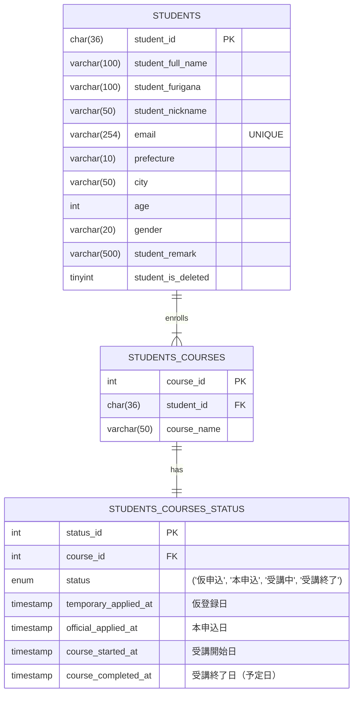
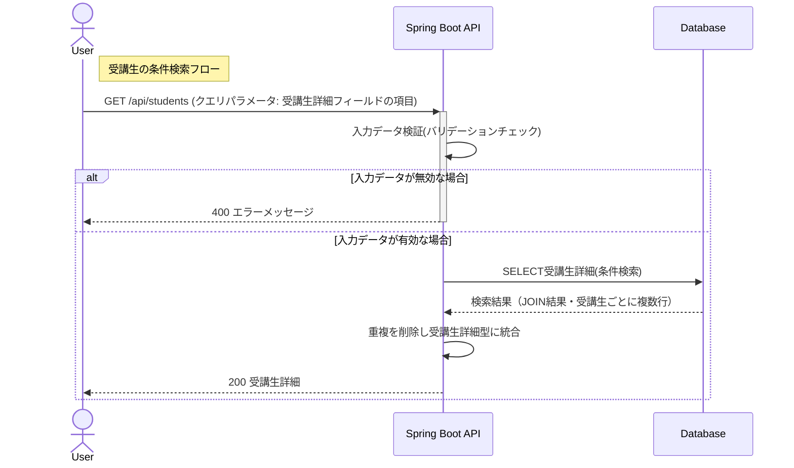
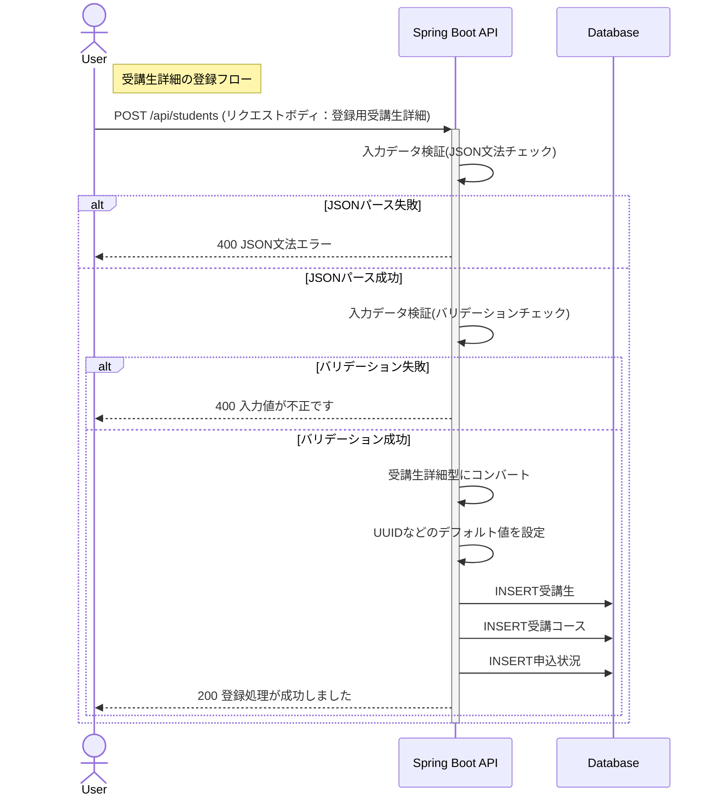
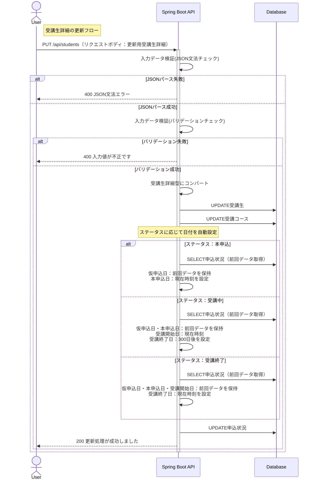

▶ デモサイト  
https://app.mitsuyonagaya-dev.com/

※ 就活用のためデータはダミーです
# 目次


- [1. 受講生管理システムの概要](#1-受講生管理システムの概要)
- [2. 技術スタック](#2-技術スタック)
- [3. 機能一覧](#3-機能一覧)
- [4. 画面・操作イメージ](#4-画面操作イメージ)
- [5. システム設計](#5-システム設計)
  - [5-1. ディレクトリ構成](#5-1-ディレクトリ構成)
  - [5-2. API設計](#5-2-api設計)
  - [5-3. データ設計：ER図](#5-3-データ設計er図)
  - [5-4. 処理設計：シーケンス図](#5-4-処理設計シーケンス図)
- [6. テスト（バックエンド）](#6-テストバックエンド)
- [7. インフラ構成図](#7-インフラ構成図)
- [8. 環境構築・起動方法](#8-環境構築起動方法)
- [9. 工夫した点・力を入れた点](#9-工夫した点力を入れた点)
- [10. レビューで得た指摘と修正内容](#10-レビューで得た指摘と修正内容)
- [11. 今後の展望](#11-今後の展望)

# 1. 受講生管理システムの概要
IT技術を教える学校が受講生の情報を保持・分析するための管理システムです。  <br>
学校運営者が使用することを想定しており、CRUD操作中心のシンプルで使いやすい設計を目指しています。

# 2. 技術スタック

### バックエンド


### フロントエンド


### データベース


### 使用ライブラリ・仕様技術


### インフラ / CI・CD


### 使用ツール


# 3. 機能一覧

| 機能       | 詳細                            |
|:---------|:----------------------------------------------------------------|
| 受講生詳細の条件検索 | 氏名・コース・申込状況など複数テーブルを跨ぐ検索条件を指定し、条件に該当する**受講生詳細**を取得します<br/>※リクエストはクエリパラメータで個別フィールドを指定     |      |
| 受講生詳細の新規登録 | 氏名や居住地域などの**受講生**の情報と、**受講コース**・**申込状況** をセットで登録します<br/>※リクエストには**登録用受講生詳細**を使用          |
| 受講生詳細の更新 | IDを指定し、任意の**受講生詳細**を更新します<br/>※リクエストには**更新用受講生詳細**を使用<br/>※削除処理については論理削除として実装しているため、更新処理として行います |

<details><summary>言葉の定義はこちら</summary>

- **受講生**：氏名、居住地域、年齢などをもつオブジェクト
- **受講コース**：受講コース名をもつオブジェクト（受講生に対して1：多の関係）
- **申込状況** ：仮申込、本申込といった申込状況、開始日などをもつオブジェクト
- **受講生詳細**：上記3つを統合したオブジェクト <br/>※DBでは正規化されて3テーブルに分離していますが、APIでは統合した形で扱います
- **登録用受講生詳細**：新規登録時のリクエストボディ
- **更新用受講生詳細**：更新時のリクエストボディ
</details>


# 4. 画面・操作イメージ
## 4-1. 受講生一覧画面（赤字：ボタン押下による実行内容）


## 4-2. モーダル一覧


## 4-3. 使用時操作動画
<details><summary>条件検索</summary>
 
https://github.com/user-attachments/assets/e6285355-fe4e-47d5-ac0f-03acbd22c322
</details>
<details><summary>新規登録</summary>
 
https://github.com/user-attachments/assets/7ad96b5d-b17e-4108-9346-9c9808d0b051
</details>
<details><summary>更新</summary>
 
https://github.com/user-attachments/assets/6401f9d6-a052-4b8a-818b-4fb44914e7cd
</details>
<details><summary>削除</summary>
 
https://github.com/user-attachments/assets/c69faf30-0bcd-451a-93c8-c3c86382eb62
</details>

# 5. システム設計

## 5-1. ディレクトリ構成

```
.
├─ frontend/                    # フロントエンド（React）
│  └─ src/
│     ├─ api/                       # API通信処理
│     ├─ components/                # モーダルコンポーネント
│     ├─ pages/                     # 画面単位のコンポーネント
│     ├─ types/                     # 型定義
│     ├─ App.tsx
│     ├─ main.tsx
│     └─ main.css
└─ backend/                     # バックエンド（Spring Boot）
   └─ src/
      └─ main/java/raisetech.student.management/
         ├─ controller/             # リクエスト受付（APIエンドポイント）
         ├─ service/                # ビジネスロジック
         ├─ repository/             # DBアクセス
         ├─ converter/              # Data ⇔ Domain / DTO 変換
         ├─ data/                   # DBから取得するデータ構造
         ├─ domain/                 # アプリケーション内部のドメインモデル
         ├─ dto/                    # フロントエンドとの受け渡し用DTO
         └─ exceptionhandler/       # 例外ハンドリング
```


## 5-2. API設計

### 5-2-1. API仕様書


<details><summary>条件検索の仕様書画面</summary>


</details>

<details><summary>新規登録の仕様書画面</summary>


</details>

<details><summary>更新の仕様書画面</summary>


</details>

### 5-2-2. APIのURL設計

| HTTP<br/>メソッド | URL                                 | 処理内容                                  | 
|---------------|-------------------------------------|---------------------------------------|
| GET           | /api/students                           | 受講生詳細の取得　クエリパラメータで条件の指定が可能です | 
| POST          | /api/students                           | 新規受講生と新規受講コースの登録               |
| PUT           | /api/students                           | 受講生詳細の更新                              |


## 5-3. データ設計：ER図
以下のER図を設計し、実装しました。

<details><summary>ER図</summary>


</details>

## 5-4. 処理設計：シーケンス図
以下のAPI処理の流れを設計し、実装しました。

<details><summary>受講生の条件検索フロー</summary>


</details>

<details><summary>受講生詳細の登録フロー</summary>
  

</details>

<details><summary>受講生詳細の更新フロー</summary>



</details>

# 6. テスト（バックエンド）
以下のテストをJUnit5で実装し、動作を検証しています。<br>
<details><summary>テストレポートはこちら</summary>
  

</details>

# 7. インフラ構成図
以下の構成でインフラを構築しました。
<details><summary>インフラ構成図</summary>
  


▶ デモサイト
https://app.mitsuyonagaya-dev.com/
</details>


# 8. 環境構築・起動方法


### 前提条件
- Node.js v24 以上
- npm
- Java 21
- MySQL 8.x

### バックエンド起動
```bash
cd backend
./gradlew bootRun
```

### フロントエンド起動（開発環境）
```bash
cd frontend
npm install
npm run dev
```

### フロントエンドビルド（S3配置用）
```bash
npm run build
```

# 9. 工夫した点・力を入れた点
## 🔶1. 要件定義の見直し：将来のデータ利活用と拡張性に耐えうるデータ構造の設計


当初の要件（ver1）に疑問を持ち、ビジネス視点での有効性を追求した結果、DB設計を刷新しました。<br>
- **思考のプロセス**
  - 「受講コース」と「申込状況」が1:1である点に着目し、それぞれの責務を分析。コース情報は「静的な属性」、申込状況は「動的な履歴」として定義し直しました。<br>
- **行った変更**:
  -  日付情報（仮申込日・本申込日・開始日等）を「申込状況」テーブルに集約。<br>
- **意図**
  - **クライアント目線**
    - 申込状況は更新頻度が高く、将来的に「リマインド送信」や「教材送付」のトリガーとなる重要なデータです。この責務を分けることで、拡張性を担保しました。
    - また、「検討期間の可視化」や「退会傾向の分析」が可能な、経営判断に寄与するデータ基盤を意識しました。
  - **開発者目線**
    - 静的データと動的データの関心を分離し、テーブルの単一責任を意識しました。これにより、ステータス更新の影響範囲をSTATUSテーブルに限定でき、またクエリがシンプルになることで保守コストの抑制も実現しました。
<details><summary>詳細な分析プロセスはこちら</summary>

 以下のプロセスで当初予定していた要件定義に変更を加えました。

**1. ver1に対する疑問**  <br>
 - 受講生コース情報と申込状況が1：1の関係である意味
 - この2つのテーブルは統合したほうが実装がシンプルなのではないか？
 - では、それぞれのテーブルの責務はなんだろうか？

**2. 責務の分析**  <br>
- **受講生コース情報**：受講生とコースの1：多の関係を管理。静的なコース属性（コース名など）を保持。
- **申し込み状況**：更新頻度が高く、動的に変化するデータを管理。業務上のトリガー判断（リマインド送信、教材送付など）の基準として使用される想定。拡張性も必要。
- **ver1の課題①（クライアント視点）**：動的データが2つのテーブルに分散しており、データ管理が非効率。
- **ver1の課題②（開発者視点）**：テーブルの責務境界が不明確で、機能拡張時の設計判断が困難。
- **改善案**：動的データ（日付情報）を申込状況テーブルに集約し、責務を明確化。

**3. 改善によるメリット**  <br>
|  | クライアント目線 | 開発者目線 |
|---|---|---|
| **ver1** | 日付情報が2項目のみで、申込状況の追跡が不十分 | テーブルの責務が曖昧で、拡張時の判断が困難 |
| **ver2** | 4つの申込状況すべての日付を管理可能 | 責務が明確になり、保守性が向上 |

**4. 上記を現役エンジニアのメンターに相談し、ver2の実装へ**  <br>
 </details>


## 🔶2. レビュワーとの対話を通した機能実装の経験
条件検索の実装において、POST（Body）かGET（Query）かの選択をそれぞれ仮説検討し、メンターに意見をもらいながら実装を進めました。
- **仮説検討**
  - 「複雑な検索にはJSON形式のPOSTが最適ではないか」と仮説を立てましたが、メンターとの対話を通じて、REST APIとしての標準性や、フロントエンド側から見た際の「クエリパラメータの許容範囲」を学びました。
- **実行**
    - 自分の固定概念（パラメータが長い＝悪）を捨て、標準的なGET処理を採用。画面UIとAPIの連携、さらには外部APIとしての利便性など、「誰がこのAPIを使うのか」を多角的に考える視点を得ました。

## 🔶 3. 実務的なデータ量を見据えた実装
検索結果を StudentDetail 型（1対Nの階層構造）に変換する際、どこで処理を行うとパフォーマンスがよくなるか検討しました。
- **仮説検討（サービス層でのコンバート）**
  - 当初は各テーブルから個別にデータを取得し、サービス層でネスト（入れ子）構造に組み立てることを検討しましたが、1:Nの関係（受講生：コース）によるループ処理が複雑化し、コードの可動性と実行速度に懸念が生じました。
- **実行（SQL結合 + 軽量コンバータ）**
  - **SQL（JOIN/resultMap）による一括取得**
    - DBの結合機能を活用し、将来を見越して高速なデータ取得を優先しました。
  - **重複排除ロジックの実装**
    - JOINの結果としてフラットに並んだデータ（同じ受講生が複数行出現する状態）を、1つの StudentDetail オブジェクトに集約する軽量なコンバータを実装。
- **得られた結果**
  - 処理速度の向上とサービス層のロジックの簡素化を両立し、実務的なデータ量にも耐えうる効率的なレスポンスを意識した実装ができました。

## 🔶4. 開発者体験の向上を意識した実装
コードの肥大化を防ぎ、変更に強い構造を目指しました。
- **三層の責務分離**
  - OpenAPIドキュメント作成の過程で外部/内部データの違いを実感し、data / domain / dto クラスを独立させました。
- **テストの最適化** <br>
  - コントローラ層のテスト肥大化を解消するため、「正常系はコントローラ、異常系（バリデーション等）はオブジェクトクラス単位」へ整理。「どこで何が保証されているか」を明確にしました。

## 🔶 5. AI活用による致命的なバグの経験
テストで通っているにもかかわらずPostmanでの実行時のみ発生した、「コースIDが0になる」問題の解決に奔走しました。
- **原因分析**
  - SQL（XMLファイル）の resultMap 定義漏れと、テストコード側の確認漏れが重複して発生していました。
- **再発防止**
  - 頭で理解しているコードは時短のためにAIを活用していましたが、「AIに渡す指示に漏れがあったこと」と「生成されたテストを信じ込みすぎたこと」が根本原因でした。
- **学び**
  - 「AIに一行ずつ説明を求める」「盲信せず自分の目で検証する」という、AI時代に必要なエンジニアの責務を痛感しました。


# 10. レビューで得た指摘と修正内容
- **REST API設計の標準化**
  - エンドポイント命名を小文字・複数形・ハイフン区切りに統一（例：`/AllStudentList` → `/students`）し、REST慣習に準拠させました。
  - `@Controller`で返していたListがJSON変換されずview名として解釈される問題を、`@RestController`への変更で修正しました。
  
- **型とバリデーションの整合性確保**
  - int型に`@NotNull`や`@Pattern`を付与していた箇所をInteger型に変更し、バリデーションが実際に機能する実装に修正しました。
  - 未入力時をエラーにしたいフィールドには`@NotNull`を明示的に追加し、意図を明確にしました。

- **JSON変換の安定化**
  - `studentMap.toString()`をそのままレスポンスとして返していた箇所を、SpringのJacksonによる正しいシリアライズが行われるよう、オブジェクト返却に修正しました。
  - デシリアライズの安定性確保のため、POJOへのセッター定義も見直しました。

- **MyBatisパラメータ参照の安全性向上**
  - コンパイル設定によっては引数名が保持されずXMLの`#{studentId}`が解決できないケースがあるため、単一引数のメソッドの`@Param`アノテーションの付与漏れを修正しました。

- **開発プロセスの改善**
  - 1PRあたりの変更粒度が大きすぎるとの指摘を受け、機能単位でコミット・PRを分割する習慣を導入しました。
  - 不要コメントの削除も合わせて実施しました。


# 11. 今後の展望
- 全体に関わる改修
  - 2つ目以降の受講コース追加機能の実装
  - 日付の手動変更の実装
  - 登録・更新に専用のDTOが本当に必要か検討
  - コース名をenum型に変更し、enumに新規開校コース追加・旧コース削除ができるようにする
  - ログイン機能の実装

- インフラ環境の構築
    - Docker導入

- バックエンドの修正
  - 認証機能の実装
  - エラーハンドリングの見直し

- フロントエンドの修正
  - コース一覧画面の追加
  - ログイン画面の追加
  - リファクタリングが必要
    - コンポーネント設計の見直し（再利用性・保守性の向上）
    - 命名規則の統一とコードの整理
    - 状態管理の最適化


